# DIY Tamagotchi
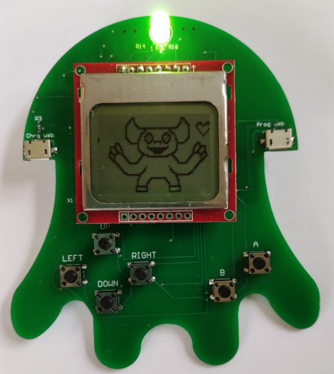

## Project introduction
This project features a 'home made' DIY Tamagotchi. <br>The aim was to create a virtual pet for which the user needs to care in order to maintain its general happiness. Caring for the Tamagotchi is done by feeding and washing it on a regular basis or by playing games with it.<br>
This README.md covers the technical details of this project and the issues I ran into.
### Content
* [Main components](#main-components)
* [Software features](#software-features)
* [Hardware features](#hardware-features)
* [How does the hardware works?](#how-does-it-work-hw)
 * [Power Supply](#how-does-it-work-hw-power)
 * [Programming interface for the XC888](#how-does-it-work-hw-programming)
 * [RTC support](#how-does-it-work-hw-rtc)
 * [Hardware blockdiagram](#hw-blockdiagram)
* [Hardware issues](#hw-issues)
 * [Inductor does not let enough current pass through](#hw-issues-inductor)
 * [Battery lifetime](#hw-issues-battery)
 * [Minor issues](#hw-issues-minor)
* [How does the software works?](#how-does-it-work-sw)
 * [Software development](#how-does-it-work-sw-dev)
 * [Bitbanged interfaces](#how-does-it-work-sw-bitbanging)
 * [Interrupt based time intervals](#how-does-it-work-sw-isr)
 * [Software blockdiagram](#sw-blockdiagram)
* [Software issues](#sw-issues)
 * [Battery lifetime](#sw-issues-battery)
 * [Memory models](#sw-issues-memory)
* [Putting everything to work](#putting-it-to-work)


<a name='main-components'></a>
### Main components
The following main components were used in order to realise this:
- XC888 micro controller (8051 family)
- Nokia 5510 LCD display
- DS1307 for RTC support
- 3.7V LiPo battery
- RGB status LED
- 6 press buttons for navigation

Note that the complete component list can be found in the BOM [here](pcb-design-Altium/bom.csv).

<a name='software-features'></a>
### Software features
- Technical
 - Small Device C Compiler aka sdcc
 - Mix of assembly & C
 - Bitbanged I²C & SPI interfaces
 - Interrupt based time interval
 - Animations based on 'diffs'
 - Views (state machines)

- Functional
 - 2 types of pets
 - Time/clock
 - Emotion shown by the virtual pet and on the RGB LED
 - Sleep time between 8 pm and 9 am
 - Satisfaction/emotion depends on care
 - Feeding, washing, playing a game

<a name='hardware-features'></a>
### Hardware features
- XC888 micro controller (8051 family)
- LiPo powered
 - Battery charging circuit on board
 - Overcharge, overdischarge & overcurrent protection
- Reprogrammable (FT232RL using micro USB)
- RTC via DS1307 (32.76KHz)
- Navigation press buttons
- Status RGB LED
<br>
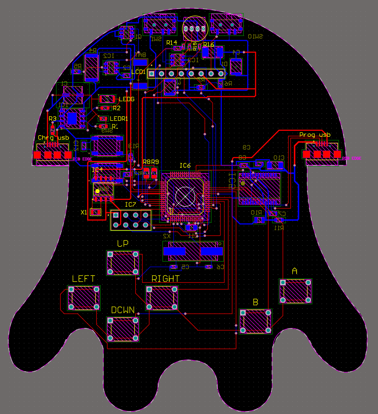

<a name='how-does-it-work-hw'></a>
## How does the hardware works?
<a name='how-does-it-work-hw-power'></a>
### 1. Power suppy
The circuit is powered by a 3.7V LiPo battery. Since most components need 5V to function, it was necessary to use a step-up IC (MT3608) to get 5.1V.
<br>
The battery can be charged through a micro USB port which is connected to a charging IC (TP4056). This charging IC is connected to battery protection IC (FS312F-G) which protects for overcharge and overdischarge. Note that the two necessary MOSFETS are externally attached for this.
<a name='how-does-it-work-hw-programming'></a>
### 2. Programming interface for the XC888
In order to program the XC888, an FT232RL is used which is connected to the right side micro USB port. For sake of simplicity two micro USB ports are present, one for Programming and one for charging. This could also be done with one micro USB port.
<a name='how-does-it-work-hw-rtc'></a>
### 3. RTC support
RTC is done through the DS1307 IC. This IC communicates with the XC888 using I²C. Since the XC888 has no native I²C support, it was necessary to bitbang this on the XC888.<br>
Note that the SDA and SCL pins are open drains, which means that external pull up resistors are normally necessary. Since the XC888 provides internal pull ups on its pins, it wasn't necessary to provide external pull ups, although they are still there in my design.

<a name='hw-blockdiagram'></a>
### Hardware block diagram
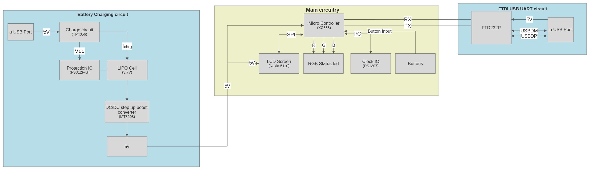

(See [schematics](pcb-design-Altium/schematics.pdf))

<a name='hw-issues'></a>
## Hardware issues
<a name='hw-issues-inductor'></a>
### 1. Inductor does not let enough current pass through
When enabling the backlight of the Tamagotchi LCD screen, the inductor (L1) used in the step up circuitry does not let enough current pass. When enabling the backlight for a longer time, the inductor will start burning as seen in the pictures below:<br>
<p align="center">
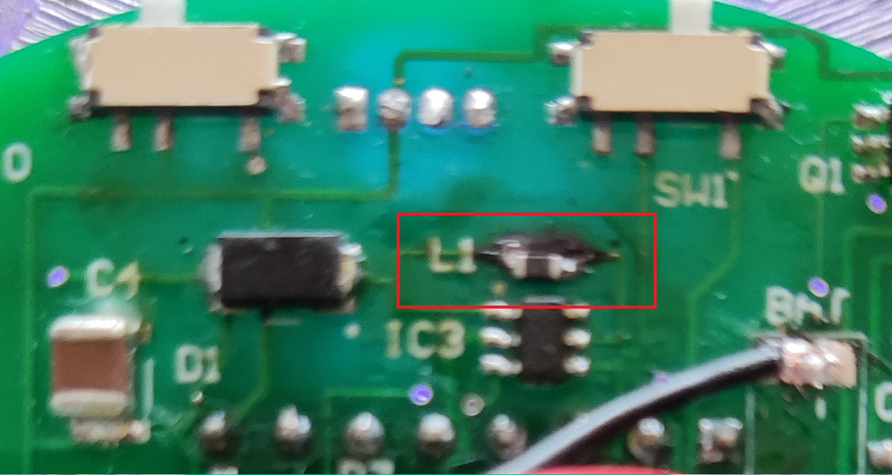
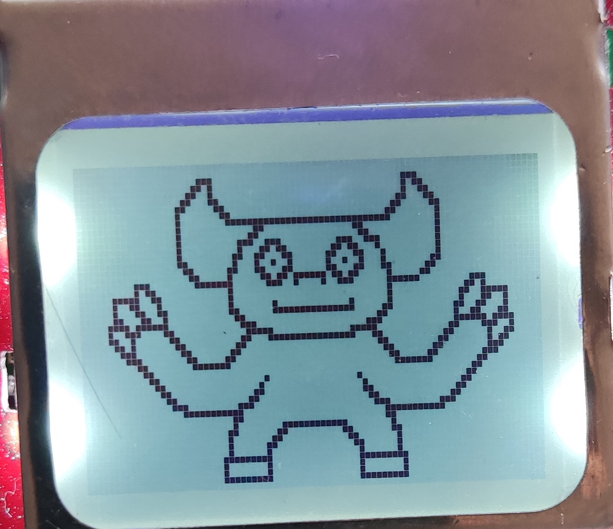
</p>

<a name='hw-issues-battery'></a>
### 2. Battery lifetime
A rough calculation of power dissipation in active components:
- Nokia LCD - `50mA * 5.1V (250mW)`
- RGB LED - `20mA * 2.7V (54mW)`
- XC888
 - Active mode & slowdown `14.1mA flash and (+) 11.9mA ROM * 5.1V = 132.6mW`
 - Active mode `27.2mA flash and (+) 24.3mA ROM * 5.1V= 262.65mW`
- DS1307 - `1.5mA * 5.1V (7.6mW)`

Rough estimation:
```
250mW + 54mW + 132.6mW + 7.6mW = 444.2mW
--> (±3.7V*1250mAh)/444.2mW = ±10h30
```
<a name='hw-issues-minor'></a>
### 3. Minor issues
1. Forgot to take up the CR battery cell holder in my design, meaning the user needs to configure the RTC each time the Tamagotchi is restarted
2. Not enough space provided to fit most micro USB cables (had to cut part of the cable in order to fit in the micro USB port)
<p align="center">
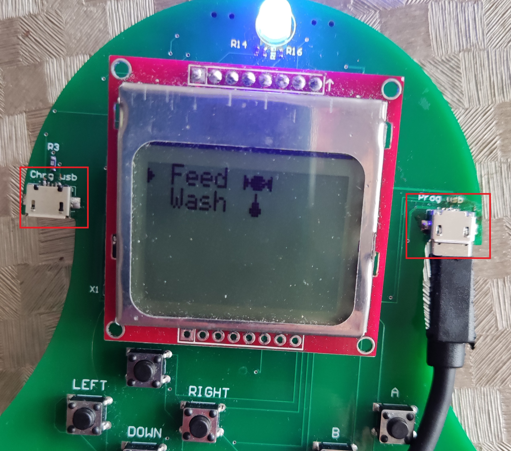
</p>

<a name='how-does-it-work-sw'></a>
## How does the software works?
<a name='how-does-it-work-sw-dev'></a>
### 1. Software development
Most of the software was written in C. The more low level parts which are part of the HAL (such as drivers) were programmed in assembly, inlined in C. The compiler used in this project is Small Device C Compiler (sdcc).
<br>
In order to determine how parameters were passed from C to the inlined assembly routines, I did the following test:
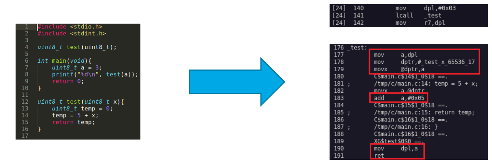
`sdcc -c --debug --use-stdout -V --xram-loc 0xF000 --xram-size 0x600 --code-size 0x5000 /tmp/c/main.c`
<br>
It appeared that arguments passed to a function are stored in the `dpl` register and from there on used in the function. Same goes for return values.
<a name='how-does-it-work-sw-bitbanging'></a>
### 2. Bitbanged interfaces
The Tamagotchi uses I²C to allow communication between the XC888 and DS1307 RTC IC. I²C is not natively supported on the XC888, meaning that it was necessary to bitbang this. Furthermore the XC888 communicates with the LCD screen using SPI. Although the XC888 has intended SPI pins, I forgot to use these in my initial design so I used other pins for the LCD which did not support SPI, resulting in Bitbanging the SPI interface as well.
In order to bitbang these, I heavily relied on a Saleae logic analyser:
<p align="center">
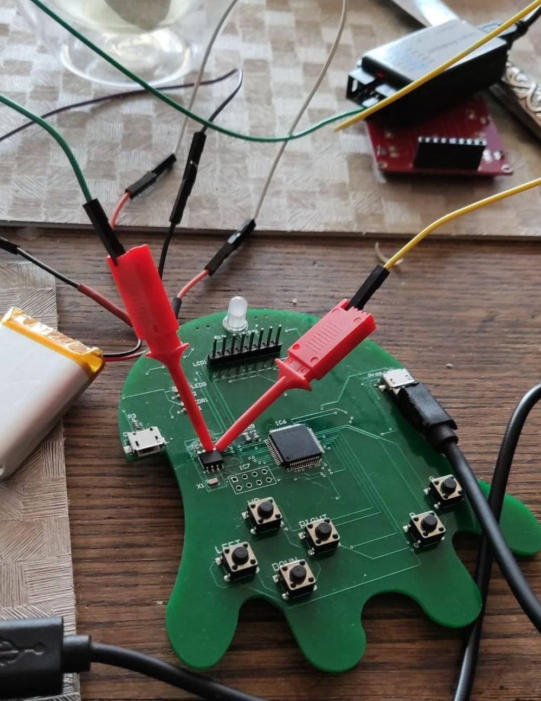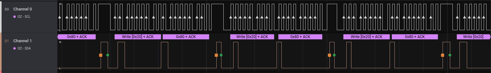
</p>

<a name='how-does-it-work-sw-isr'></a>
### 3. Interrupt based time intervals
Because reading the RTC IC is considered to be expensive due to the nature of bitbanging, I tried to limit the reads towards it using a 1 second interrupt interval.
```
typedef struct time_t{
        uint8_t millis;
        uint8_t seconds;
        uint8_t minutes;
}time_t;

void timer0_isr_time (void) __interrupt (TIMER0_INTERRUPT)
{
        //TIME
    static uint16_t current_count_time = 0;
    //48000 ticks = 1 sec
    if(++current_count_time == 48000){
        ticks += 1;
        current_count_time = 0;
        time.seconds += 1;
    }   
}
```
Enabling the timer was done by setting the following registers to its corresponding values:
```
void inittimer(void){
        tmod = 0b00000010; //Timer 0 8 bit autoreload
        et0 = 1; //Enable Timer 0 interrupts
        ea = 1; //Globale interrupt enable
        th0 = 6;
        tl0 = 6;
        tr0 = 1;
}
```
Only if `time.seconds == 60` the RTC is polled:
```
while(1){          
  if(time.seconds == 60){
    time.seconds = 0;
    read_rtc(&now);
    if(tam->emotion != 4 && (now.hour >= 0x20 || now.hour < 0x9)){
                        ...
    }
}
```

<a name='sw-blockdiagram'></a>
### Software blockdiagram
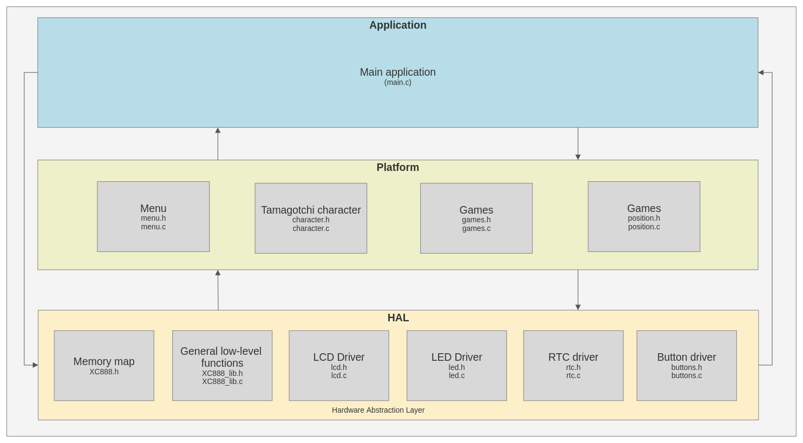

<a name='sw-issues'></a>
## Software issues
<a name='sw-issues-battery'></a>
### 1. Battery life time
I attempted to address the (short) battery lifetime issue using the power saving modes of the XC888.<br>
The following was mentioned in the XC888 datasheet:
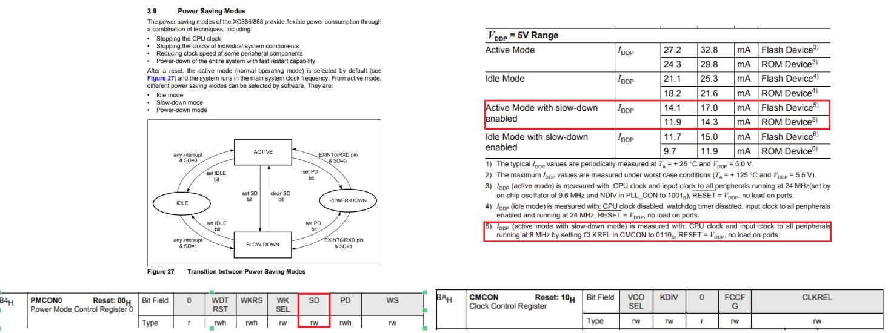
According to this it is possible to get into slowdown mode by forcing the CLCKREL register to 0110 and by activating the 'slowdown' (SD) bit in the pmcon register.
```
cmcon &= ~(1UL << 0);
cmcon |= 1UL << 1;
cmcon |= 1UL << 2;
cmcon &= ~(1UL << 3);

pmcon0 |= 1UL << 2;
```
<a name='sw-issues-memory'></a>
### 2. Memory models
When compiling with the following command (which worked in the beginning), I started to getting errors after a while:<br>
<code>
$ sdcc --debug <b>--model-small</b> --use-stdout -V --xram-loc 0xF000 --xram-size 0x600 --code-size 0x7000 -I/home/xoreo/sdcc-Tamagotchi/ -o/home/xoreo/sdcc-Tamagotchi/main.hex /home/xoreo/sdcc-Tamagotchi/main.rel /home/xoreo/sdcc-Tamagotchi/xc888_lib.rel /home/xoreo/sdcc-Tamagotchi/led.rel /home/xoreo/sdcc-Tamagotchi/lcd.rel /home/xoreo/sdcc-Tamagotchi/buttons.rel /home/xoreo/sdcc-Tamagotchi/position.rel /home/xoreo/sdcc-Tamagotchi/character.rel /home/xoreo/sdcc-Tamagotchi/menu.rel /home/xoreo/sdcc-Tamagotchi/rtc.rel /home/xoreo/sdcc-Tamagotchi/games.rel
</code><br>
The following error was returned:
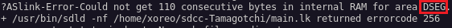
<br>
Using the `--model-medium` compiler flag instead solved the problem for some extra time, until I received the next error:<br>
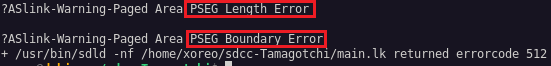<br>
This forced me using the `--model-large` flag.<br>
According to the datasheet (https://usermanual.wiki/Document/sdcc20manual.1813032903/html#pf3d - page 60), `--model-large` and `--model-hughe`  are discouraged (I couldn't figure out why?)
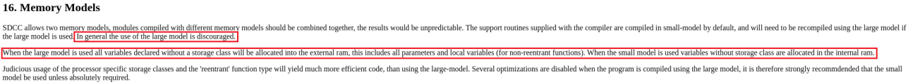

The datasheet mentioned the following about the different memory models:
- `--model-small`:<br>Variables reside in the internal RAM / data segment
- `--model-medium`:<br>Variables reside in pdata (which is 256 bytes)
- `--model-large`:<br>Variables reside in xdata
<a name='putting-it-to-work'></a>
## Putting everything to work
This repository contains everything to recreate this project. <br>In order to getting al this to work, the gerber files inside the `pcb-design-Altium` folder can be sent to your preferred PCB manufacturer. Inside the `pcb-design-Altium` folder, the Bill of Materials (BOM) can be found as well. All these components are necessary to get a working version. Once the PCB is manufactured and delivered, these can be soldered onto the PCB (which requires some SMD soldering).<br>
Once everything is put together, it is time to flash the micro controller. This can either be done by compiling the software your self (a `compile.sh` file is included which should do the job), otherwise it is also possible to use the `main.hex` file.<br>
Flashing the XC888 can be done by using the free software XC800_FLOAD (provided by Infineon).
In order to do so, select the correct COM port and `Target Device: XC888-8FF`.<br>
Note that the Tamagotchi must enter programming mode first, by pressing the 'SW9' SMD push button at the back, than the 'SW8' push button (also at the back) & (without releasing 'SW9') and than releasing both buttons. If everything is soldered correct and the right COM port is chosen, Fload should allow you to connect to your Tamagotchi in order to download the main.hex file to your Tamagotchi :)
